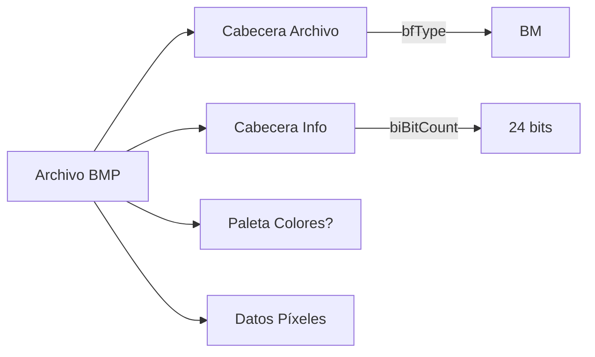

#Archivos #Computación #Imágenes 
# Archivos BMP (Bitmap)

## 📌 Definición
- Formato de imagen **sin compresión** (generalmente) desarrollado por Microsoft.
- Usa un **formato de mapa de bits** para almacenar imágenes digitales.
- **Extensión común**: `.bmp` (a veces `.dib` -> Device Independent Bitmap).

---

## 🏗️ Estructura del Archivo BMP
Un archivo BMP tiene 4 partes principales:

### 1. **Cabecera del Archivo (`BITMAPFILEHEADER`)**
- Tamaño: **14 bytes**.
- Campos clave:
  - `bfType` (2 bytes): Siempre `BM` (0x4D42 en hexadecimal).
  - `bfSize`: Tamaño total del archivo.
  - `bfOffBits`: Offset donde comienzan los datos de píxeles.

### 2. **Cabecera de Información (`BITMAPINFOHEADER`)** 
- Tamaño: **40 bytes** (versión más común).
- Campos clave:
  - `biWidth`, `biHeight`: Dimensiones en píxeles.
  - `biBitCount`: Bits por píxel (1, 4, 8, 16, 24, 32).
  - `biCompression`: Tipo de compresión (0 = sin compresión).

### 3. **Paleta de Colores** (Opcional)
- Solo en BMP con ≤ 8 bits por píxel.
- Array de estructuras `RGBQUAD` (4 bytes cada una).

### 4. **Datos de Píxeles**
- Almacenados en **orden inverso** (comienza desde la fila inferior).
- **Padding**: Cada fila de píxeles debe ser múltiplo de 4 bytes (se rellena con ceros si es necesario).

---

## 🔍 Ejemplo Hexadecimal (Cabecera BMP)
```plaintext
42 4D          // "BM" (firma)
36 00 00 00    // Tamaño archivo: 54 bytes
00 00          // Reservado
00 00          // Reservado
36 00 00 00    // Offset datos píxeles: 54 bytes
```

---

## 🎨 Formatos de Color
| Bits/Píxel | Colores Máx. | Uso común               |
|------------|--------------|-------------------------|
| 1          | 2 (blanco/negro) | Iconos monocromos    |
| 8          | 256           | Gráficos antiguos       |
| 24         | 16.7 millones | Imágenes RGB modernas   |
| 32         | + canal Alpha | Transparencias (ARGB)   |

---

## ⚙️ Pros y Contras
### ✅ Ventajas
- **Sin pérdida de calidad** (no hay compresión).
- **Soporte universal** (abierto y simple).
- **Transparencia** (en BMP de 32 bits).

### ❌ Desventajas
- **Tamaño enorme** (ej: 800x600 en 24 bits ≈ 1.4 MB).
- **Sin metadatos** (como EXIF en JPEG).

---

## 📂 Ejemplo en Mermaid (Estructura BMP)


---

## 🛠️ Herramientas Relacionadas
- **Editores**: GIMP, Photoshop.
- **Análisis Binario**: `xxd`, `hexdump`, [[Binwalk]] (para detectar BMP embebidos).
- **Conversión**: `ffmpeg -i imagen.bmp imagen.png`.o manipular BMP programáticamente o en su uso en esteganografía?