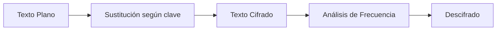

#Datos #Encriptación #Criptografía #Seguridad 
### **Cifrado por Sustitución**  
**Definición**:  
Método de cifrado donde cada letra del texto plano se reemplaza por otra letra o símbolo siguiendo una regla fija (clave).  

---

#### **1. Tipos de Cifrado por Sustitución**  
1. **Sustitución Monoalfabética**:  
   - Un alfabeto de sustitución fijo (ej: `A → D, B → E, ..., Z → C`).  
   - Ejemplo: **Cifrado César** (desplazamiento fijo).  

2. **Sustitución Polialfabética**:  
   - Usa múltiples alfabetos de sustitución (ej: **Cifrado Vigenère**).  

3. **Sustitución Homofónica**:  
   - Una letra del texto plano puede mapearse a múltiples símbolos (ej: `A → 12, 25; B → 07`).  

4. **Sustitución por Palabra Clave**:  
   - Se usa una palabra para generar el alfabeto cifrado (ej: clave "SECRETO" → alfabeto: `S,E,C,R,T,O,A,B,D,...`).  

---

#### **2. Ejemplo Básico (Monoalfabético)**  
- **Alfabeto original**: `A B C D E F G H I J K L M N O P Q R S T U V W X Y Z`  
- **Alfabeto cifrado**: `D E F G H I J K L M N O P Q R S T U V W X Y Z A B C` (desplazamiento +3).  

**Mensaje**: `HELLO` → **Cifrado**: `KHOOR`.  

$$
\text{Cifrado: } H \rightarrow K, E \rightarrow H, L \rightarrow O, O \rightarrow R  
$$  

---

#### **3. Implementación en [[Python]] (Opcional)**  
```python  
def sustitución_mono(texto, desplazamiento=3):  
    cifrado = ""  
    for letra in texto.upper():  
        if letra.isalpha():  
            nueva_letra = chr((ord(letra) - ord('A') + desplazamiento) % 26 + ord('A'))  
            cifrado += nueva_letra  
    return cifrado  

print(sustitución_mono("HELLO"))  # Salida: "KHOOR"  
```  

---

#### **4. Ventajas y Debilidades**  
- **✔️ Ventajas**:  
  - Simple de implementar.  
  - Rápido para mensajes cortos.  

- **✖️ Debilidades**:  
  - Vulnerable a **análisis de frecuencia** (ej: en inglés, 'E' es la letra más común).  
  - Clave fija → fácil de romper con fuerza bruta o patrones.  

---

#### **5. Ataques Comunes**  
1. **Análisis de Frecuencia**:  
   - Comparar la frecuencia de letras en el texto cifrado con el idioma original.  
   - Ejemplo en español: `E, A, O, S` son las más frecuentes.  

2. **Fuerza Bruta**:  
   - Probar todas las combinaciones posibles (26! en sustitución monoalfabética).  

---

#### **6. Visualización**
##### **Tabla de Frecuencias**  
| Letra | Frecuencia (%) |  
|-------|---------------|  
| E     | 13.68         |  
| A     | 12.53         |  
| O     | 8.68          |  

##### **Diagrama Mermaid**  


---

#### **7. Ejemplo Avanzado (Sustitución por Palabra Clave)**  
- **Clave**: "CRIPTO" → Alfabeto cifrado: `C, R, I, P, T, O, A, B, D, E, F, G, H, J, K, L, M, N, Q, S, U, V, W, X, Y, Z`.  
- **Mensaje**: "SEGURIDAD" → **Cifrado**: `LTOQSBPCT`.  

---

#### **8. Referencias y Enlaces**  
- [[Cifrado César]]