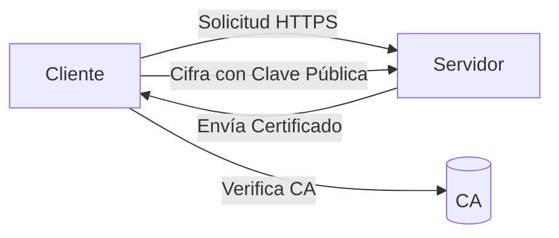

#Redes #Computación #Comunicación #Seguridad 
# HTTPS (HyperText Transfer Protocol Secure)

## 📌 Definición
- **HTTPS** es la versión segura de [[HTTP]], que cifra la comunicación entre el cliente (navegador) y el servidor web.
- **Objetivo principal**: Garantizar Confidencialidad, Integridad y Autenticación de los datos.
## 🔐 Componentes Clave
1. **[[SSL/TLS]]**:
   - Protocolos de cifrado que protegen los datos en tránsito.
   - TLS (Transport Layer Security) es la evolución de SSL (Secure Sockets Layer).
   
2. **Certificados Digitales**:
   - Emitidos por [[Autoridades Certificadoras (CA)]].
   - Incluyen información del dominio, titular y clave pública ([[Criptografía Asimétrica]]).

3. **Puerto Predeterminado**: `443` (vs. HTTP en puerto `80`).

## 🔄 ¿Cómo Funciona?
1. **Handshake TLS**:
   - Negociación de algoritmos de cifrado.
   - Autenticación del servidor mediante su certificado.
   - Intercambio de claves (ej. [[Diffie-Hellman]] para [[Forward Secrecy]]).
   
2. **Cifrado de Datos**:
   - Uso de [[AES]] (simétrico) para velocidad.
   - Clave simétrica intercambiada de forma segura vía RSA/ECDH.

## 📜 Beneficios
- **Seguridad**: Evita [[Man in the Middle]] y [[Sniffing]].
- **SEO**: Google prioriza sitios HTTPS.
- **Confianza**: Muestra el candado verde en el navegador.

## ⚠️ Consideraciones
- **Rendimiento**: Overhead por cifrado (minimizado con HTTP/2 o HTTP/3).
- **Configuración Correcta**: Evitar certificados vencidos o errores como [[Mixed Content]].

## 📂 Ejemplo

