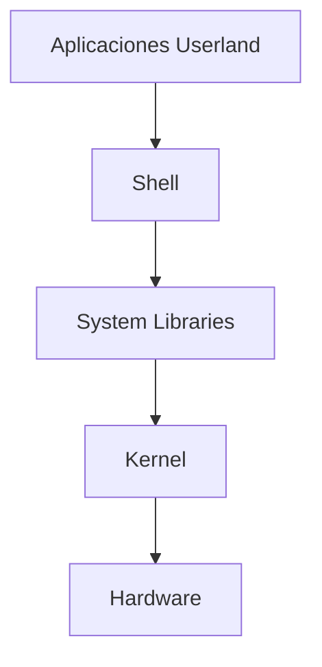

#SistemaOperativo #Software #OpenSource #Linux 
# **Linux: Sistema Operativo de Código Abierto - Guía Completa**

## 🐧 **Introducción a Linux**
Linux es un sistema operativo **open-source** basado en Unix, creado por **Linus Torvalds** en 1991. Es conocido por su estabilidad, seguridad y flexibilidad, siendo el sistema más usado en servidores, supercomputadoras y dispositivos embebidos.

### **Características Clave**:
✔ **Multiusuario y multitarea**  
✔ **Soporte para múltiples arquitecturas**  
✔ **Altamente personalizable**  
✔ **Gran comunidad de desarrollo**  
✔ **Seguridad robusta (SELinux, AppArmor)**  

## 🏗 **Arquitectura de Linux**

- **Kernel**: Corazón del sistema (gestión de procesos, memoria, dispositivos)
- **Shell**: Intérprete de comandos (Bash, Zsh, Fish)
- **GNU Utilities**: Herramientas básicas (ls, grep, awk)
- **Entorno Gráfico**: GNOME, KDE, XFCE

## 📂 **Sistema de Archivos**
- **Estructura jerárquica** (basada en FHS - Filesystem Hierarchy Standard)
- **Principales directorios**:
  - `/bin`: Binarios esenciales
  - `/etc`: Archivos de configuración
  - `/home`: Directorios de usuarios
  - `/var`: Datos variables (logs, caché)
  - `/dev`: Dispositivos
  - `/proc`: Sistema de archivos virtual (info del kernel)

## 💻 **Comandos Básicos**
| Comando     | Descripción        |
| ----------- | ------------------ |
| [[ls]]      | Listar archivos    |
| [[cd]]      | Cambiar directorio |
| [[grep]]    | Buscar patrones    |
| [[chmod]]   | Cambiar permisos   |
| [[sudo]]    | Ejecutar como root |
| `apt`/`yum` | Gestor de paquetes |
| `ps`        | Procesos activos   |
| [[ssh]]     | Conexión remota    |

## 🛠 **Gestión de Paquetes**
| Distribución | Gestor | Comando Instalación |
|-------------|--------|---------------------|
| Debian/Ubuntu | APT | `sudo apt install paquete` |
| RHEL/CentOS | YUM/DNF | `sudo yum install paquete` |
| Arch/Manjaro | Pacman | `sudo pacman -S paquete` |
| OpenSUSE | Zypper | `sudo zypper install paquete` |

## 🔐 **Permisos y Usuarios**
- **Modelo de permisos POSIX**:
  - `r` (lectura), `w` (escritura), `x` (ejecución)
  - Usuario → Grupo → Otros
- **Comandos clave**:
  ```bash
  chmod 755 archivo  # rwxr-xr-x
  chown usuario:grupo archivo
  useradd nuevo_usuario
  ```

## 🌐 **Redes en Linux**
- **Configuración básica**:
  ```bash
  ifconfig  # Info de interfaces (obsoleto)
  ip addr   # Alternativa moderna
  ping google.com
  netstat -tulnp
  ```
- **Firewall**:
  ```bash
  sudo ufw enable  # Ubuntu
  sudo firewall-cmd --list-all  # RHEL/CentOS
  ```

## 🐋 **Contenedores y Virtualización**
- **Docker**:
  ```bash
  docker run -it ubuntu bash
  docker ps -a
  ```
- **Podman**: Alternativa sin demonio
- **KVM**: Virtualización nativa

## 🚀 **Linux en la Nube**
- **AWS/Azure/GCP**: Mayoría de instancias usan Linux
- **Kubernetes**: Orquestación de contenedores
- **Terraform**: Infraestructura como código

## 📊 **Distribuciones Populares**
| Tipo | Ejemplos |
|------|----------|
| **Beginners** | Ubuntu, Linux Mint |
| **Servers** | Debian, CentOS, RHEL |
| **Lightweight** | Arch, Alpine |
| **Security** | Kali, Parrot |
| **Enterprise** | SUSE, Oracle Linux |

## ⚙️ **Personalización Avanzada**
- **Kernel Custom**: Compilar con configuraciones específicas
- **i3wm**: Gestor de ventanas minimalista
- **Dotfiles**: Configuraciones personalizadas (~/.bashrc)

## 🔧 **Troubleshooting**
- **Logs**: `/var/log/`
- **Diagnóstico**:
  ```bash
  dmesg  # Mensajes del kernel
  journalctl  # Systemd logs
  top/htop   # Monitorización
  ```

## 🎯 **Por qué Linux?**
- **Control total** sobre el sistema
- **Sin bloatware** ni telemetría
- **Gratis y open-source**
- **Mejor rendimiento** en hardware antiguo
- **Dominio en DevOps y Cloud**

Linux es el sistema operativo más versátil, potenciando desde smartphones (Android) hasta la Estación Espacial Internacional. Su filosofía open-source y su robustez técnica lo hacen indispensable en el mundo tecnológico actual.