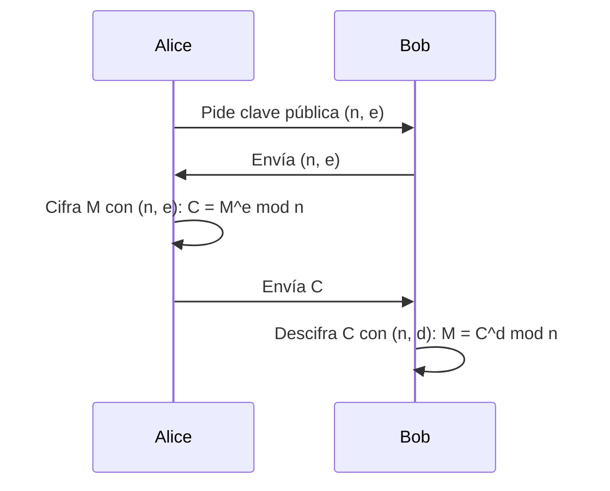

#Hacking #Algoritmo #Software #Seguridad #Criptografía 
# RSA (Rivest-Shamir-Adleman)

## 📌 Definición
**RSA** es un algoritmo de criptografía asimétrica basado en la dificultad de factorizar números enteros grandes en sus factores primos. Fue creado en 1977 por Rivest, Shamir y Adleman.

## 🔑 Conceptos Clave
1. **Clave pública**: Par $(n, e)$.
2. **Clave privada**: Par $(n, d)$.
3. **Generación de claves**:
   - Seleccionar dos primos grandes $p$ y $q$.
   - Calcular $n = p \times q$ (módulo).
   - Calcular $\phi(n) = (p-1)(q-1)$ (función phi de Euler).
   - Elegir $e$ (exponente público) coprimo con $\phi(n)$.
   - Calcular $d$ (exponente privado) como el inverso modular de $e \mod \phi(n)$.

## ⚙️ Funcionamiento
### Cifrado
$$
C = M^e \mod n
$$
- $M$: Mensaje original (convertido a número).
- $C$: Mensaje cifrado.

### Descifrado
$$
M = C^d \mod n
$$

### Firma Digital
1. **Firmar**: $S = H(M)^d \mod n$ (hash del mensaje elevado a $d$).
2. **Verificar**: $H(M) \equiv S^e \mod n$.

## 📊 Ejemplo Numérico (Simplificado)
1. **Generación de claves**:
   - $p = 61$, $q = 53$. -[[números primos]] distintos muy granes-
   - $n = 61 \times 53 = 3233$. -el el módulo (lo compartes las llaves públicas como privada)-
   - $\phi(n) = 60 \times 52 = 3120$. -(p-1)\*(q-1)-
- $e = 17$ (coprimo con 3120). -llave pública, llamado exponente: suele tener el número fijo 65537 = 2^16+1
   - $d = 2753$ (porque $17 \times 2753 \mod 3120 = 1$).
   
2. **Cifrar "A" (ASCII 65)**:
   - $C = 65^{17} \mod 3233 = 2790$. -c = m^e (mod n) {en [[Python]] con pow(m,e,n)}-

3. **Descifrar**:
   - $M = 2790^{2753} \mod 3233 = 65$. -para [[Desencriptación|desencriptar]] (d = e^-1 (modtn)); en [[Python]] con pow(e,-1,tn)-

## 🔐 Seguridad
- **Base matemática**: Dificultad de factorizar $n$ en $p$ y $q$ (problema NP).
- **Longitud de clave recomendada**: 
  - 2048 bits (estándar actual).
  - 4096 bits para seguridad a largo plazo.
- **Ataques comunes**:
  - Factorización (ej: algoritmo GNFS).
  - Timing attacks.
  - Fault injection.

## ⚠️ Limitaciones
1. **Velocidad**: Lento comparado con algoritmos simétricos (por eso se usa para intercambiar claves).
2. **Padding**: Requiere esquemas seguros como OAEP (evita ataques como el de texto plano).
3. **Quantum risk**: Vulnerable a computación cuántica (algoritmo de Shor).

## 🌟 Aplicaciones
- **HTTPS/SSL**: Intercambio de claves.
- **Firmas digitales** (ej: documentos PDF).
- **Encriptación de emails** (PGP/GPG).
- **Blockchain**: Firmas de transacciones.

## 📚 Implementación en [[Python]]
```python
from Crypto.PublicKey import RSA
from Crypto.Cipher import PKCS1_OAEP

# Generar claves
key = RSA.generate(2048)
private_key = key.export_key()
public_key = key.publickey().export_key()

# Cifrar
cipher = PKCS1_OAEP.new(RSA.import_key(public_key))
ciphertext = cipher.encrypt(b"Mensaje secreto")

# Descifrar
cipher = PKCS1_OAEP.new(RSA.import_key(private_key))
plaintext = cipher.decrypt(ciphertext)
```

---

💡 **Nota**: RSA es determinista (sin salt) por lo que **nunca** debe usarse sin padding (como PKCS1_OAEP) para evitar ataques.

### Diagrama Mermaid (para Obsidian)


🔗 **Enlaces útiles**:
- [[Criptografía Asimétrica]]
- [[Teoría de Números]]
- [[PKI]]