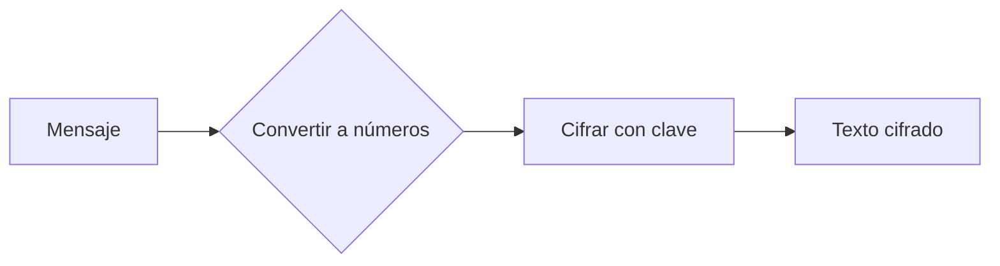

#Datos #Texto #Encriptación #Historia #Hacking 

### **Cifrado Vigenère**
**Definición**:  
Método de cifrado polialfabético que usa una clave repetida para desplazar letras del mensaje original. Es más seguro que el [[cifrado César]] (que usa un único desplazamiento).

---

#### **1. Conceptos Clave**
- **Clave**: Palabra o frase que determina los desplazamientos (ej: `CLAVE`).
- **Alfabeto**: Usualmente el latino (A-Z, 26 letras).
- **Módulo 26**: Las operaciones aritméticas se ajustan a este rango.

---

#### **2. Fórmulas**
##### **Cifrado**:
```latex
C_i = (M_i + K_{i \mod len(K)}) \mod 26
```
- \( C_i \): Letra cifrada.  
- \( M_i \): Letra del mensaje original (A=0, B=1, ..., Z=25).  
- \( K \): Clave (convertida a números).  

##### **Descifrado**:
```latex
M_i = (C_i - K_{i \mod len(K)}) \mod 26
```

---

#### **3. Ejemplo Práctico**
**Mensaje**: `ATACAR`  
**Clave**: `SOL` (se repite: `SOLSOL`)  

| Paso       | Cálculo                          | Resultado |
|------------|----------------------------------|-----------|
| **Cifrado** | A (0) + S (18) = 18 → `S`       | S         |
|            | T (19) + O (14) = 33 → 33-26=7 → `H` | H         |
|            | A (0) + L (11) = 11 → `L`       | L         |
| **Texto cifrado** | `SHL` (primeras 3 letras) | ...       |

**Bloque de código en Obsidian**:
```python
# Ejemplo en Python (opcional para tus apuntes)
def vigenere_encrypt(text, key):
    encrypted = []
    key_repeated = (key * ((len(text) // len(key)) + 1))[:len(text)]
    for m, k in zip(text, key_repeated):
        encrypted_char = chr(((ord(m) + ord(k)) % 26) + ord('A'))
        encrypted.append(encrypted_char)
    return ''.join(encrypted)
```

---

#### **4. Ventajas y Debilidades**
- **✔️ Ventajas**:  
  - Resistente al análisis de frecuencia (vs. César).  
  - Fácil de implementar.  

- **✖️ Debilidades**:  
  - Si la clave es corta o repetida, es vulnerable al **ataque Kasiski**.  
  - No seguro para estándares modernos.  

---

#### **5. Visualización con LaTeX**
Para mostrar la fórmula de cifrado en un bloque centrado:
```latex
$$
C_i = (M_i + K_{i \mod len(K)}) \mod 26
$$
```
Resultado:  
$$ C_i = (M_i + K_{i \mod len(K)}) \mod 26 $$

---

#### **6. Diagrama de Flujo**
Puedes crear un diagrama Mermaid en Obsidian para visualizar el proceso:


### Temas relacionados:
- [[Criptografía]]
- [[Cifrado César]]