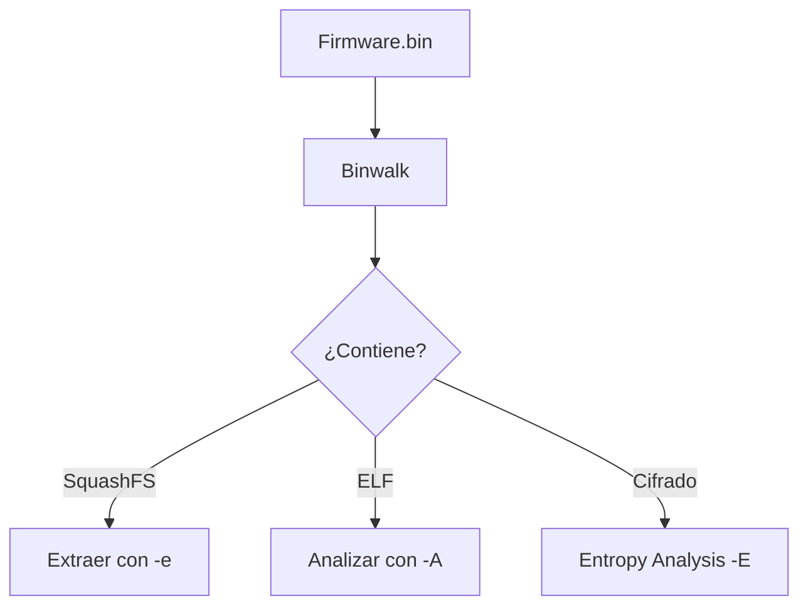

#Comando #Software #Hacking #Desempaquetar
# Binwalk: Análisis de Firmware y Archivos Binarios

## 📌 Definición
- **Binwalk** es una herramienta de análisis forense y reversión de firmware que permite extraer archivos incrustados dentro de otros binarios.
- Usos comunes:
  - Extraer firmwares de dispositivos IoT ([[IoT Security]]).
  - Analizar malware ([[Malware Analysis]]).
  - Identificar formatos de archivos ocultos ([[File Signatures]]).

## 🔧 Instalación
```bash
# En distribuciones basadas en Debian:
sudo apt install binwalk

# Con todas las dependencias (recommendado):
sudo apt install binwalk python3-matplotlib
```

## 🛠️ Comandos Básicos

### 1. **Escaneo Básico**
```bash
binwalk archivo.bin
```
- Muestra firmas de archivos ([[File Signatures]]) y offsets.

### 2. **Extracción de Archivos**
```bash
binwalk -e archivo.bin
```
- Extrae archivos reconocidos en una carpeta (`_archivo.bin.extracted/`).

### 3. **Análisis en Profundidad**
```bash
binwalk -Me archivo.bin
```
- **Recursivo**: Extrae múltiples capas de archivos.
- **Matriz de entropía**: `-E` para detectar datos cifrados/comprimidos ([[Entropy Analysis]]).

### 4. **Firmware de Dispositivos IoT**
```bash
binwalk -f firmware.bin
```
- Útil para analizar routers, cámaras IP, etc. ([[IoT Hacking]]).

## 🔍 Opciones Avanzadas
| Opción          | Descripción                                  |
|-----------------|---------------------------------------------|
| `-A`            | Escanear códigos de máquina (ARM, MIPS, etc.) |
| `-W`            | Comparar archivos binarios (diffing)         |
| `-C <dir>`      | Especificar directorio de extracción         |
| `--signature`   | Escanear firmas personalizadas              |

## 🧩 Ejemplo Práctico
### Analizar un Firmware de Router
```bash
binwalk -Me firmware_router.bin
```
1. Identifica particiones (`squashfs`, `ubifs`).
2. Extrae el sistema de archivos.
3. Revela archivos críticos:
   - `/etc/shadow` (posibles contraseñas hasheadas).
   - `/bin/httpd` (servidor web del dispositivo).

## ⚠️ Consideraciones
- **Falsos positivos**: Binwalk puede detectar firmas incorrectas (verificar manualmente).
- **Herramientas complementarias**:
  - `dd` para extraer particiones manualmente.
  - `ghex` o `xxd` para inspección hexadecimal.

## 📂 Diagrama (Mermaid)
