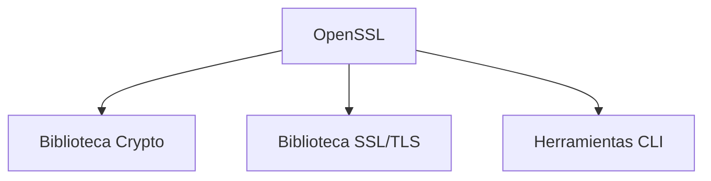

#Software #Linux #Comando #All 
# **OpenSSL: Guía Completa - La Navaja Suiza de la Criptografía**

## 🔐 **¿Qué es OpenSSL?**
OpenSSL es un **toolkit de código abierto** que implementa los protocolos SSL/TLS y proporciona una suite completa de herramientas criptográficas. Es el estándar de facto para:

- Generación de certificados digitales
- Cifrado/descifrado de datos
- Implementación de protocolos seguros
- Operaciones criptográficas avanzadas

## 🏆 **Datos Clave**
- **Lanzamiento inicial**: 1998
- **Escrito en**: C
- **Licencia**: Apache-style
- **Alternativas**: LibreSSL, BoringSSL (fork de Google)

## 🛠 **Componentes Principales**


## 💻 **Comandos Esenciales (Terminal)**

### 1. **Generación de Claves**
```bash
# RSA 4096 bits (estándar actual)
openssl genpkey -algorithm RSA -out private.key -aes256 -pkeyopt rsa_keygen_bits:4096

# Curvas elípticas (ECDSA, más moderno)
openssl ecparam -name secp384r1 -genkey -noout -out ec-key.pem
```

### 2. **CSR (Certificate Signing Request)**
```bash
openssl req -new -key private.key -out request.csr -sha256
```
*(Interactivo o con configuración automática)*

### 3. **Autofirmar Certificados**
```bash
openssl req -x509 -newkey rsa:4096 -keyout key.pem -out cert.pem -days 365 -nodes
```

### 4. **Verificar Certificado**
```bash
openssl x509 -in cert.pem -text -noout
```

## 🔍 **Operaciones Avanzadas**

### **Cifrado/Descifrado**
```bash
# Cifrar archivo (AES-256-CBC)
openssl enc -aes-256-cbc -salt -in secreto.txt -out secreto.enc

# Descifrar
openssl enc -d -aes-256-cbc -in secreto.enc -out secreto.txt
```

### **Firma Digital**
```bash
# Crear hash y firmar
openssl dgst -sha256 -sign private.key -out firma.sha256 documento.pdf

# Verificar firma
openssl dgst -sha256 -verify public.key -signature firma.sha256 documento.pdf
```

## 🌐 **SSL/TLS Práctico**

### **Testear Servidor HTTPS**
```bash
openssl s_client -connect ejemplo.com:443 -servername ejemplo.com | openssl x509 -text
```

### **Generar Certificado Wildcard**
```bash
openssl req -new -newkey rsa:4096 -nodes -keyout wildcard.key -out wildcard.csr -subj "/CN=*.dominio.com"
```

## ⚠️ **Seguridad y Buenas Prácticas**
- **Nunca usar SSLv3**: Vulnerable a POODLE
- **Evitar SHA-1**: Obsoleto desde 2017
- **Configuraciones seguras**:
  ```bash
  openssl ciphers -v 'TLS_AES_256_GCM_SHA384:ECDHE-ECDSA-AES256-GCM-SHA384'
  ```
- **Rotación periódica**: Certificados >2 años son riesgo

## 🐛 **Debugging Común**
```bash
# Ver errores SSL
openssl s_client -showcerts -connect problema.com:443 -debug

# Checkear fecha expiración
openssl x509 -in cert.pem -noout -dates
```

## 📊 **Algoritmos Soportados**
| Tipo | Algoritmos |
|------|-----------|
| **Hash** | SHA-2, SHA-3, MD5 (obsoleto) |
| **Cifrado** | AES, ChaCha20, 3DES (obsoleto) |
| **Clave Pública** | RSA, ECDSA, EdDSA |
| **Protocolos** | TLS 1.2/1.3, DTLS |

## 🚀 **Integración con Servidores**
### **Apache**
```apache
SSLEngine on
SSLCertificateFile /ruta/cert.pem
SSLCertificateKeyFile /ruta/private.key
```

### **Nginx**
```nginx
ssl_certificate /ruta/fullchain.pem;
ssl_certificate_key /ruta/private.key;
ssl_protocols TLSv1.2 TLSv1.3;
```

## 🔮 **Futuro de OpenSSL**
- **Post-Cuántica**: Integración de algoritmos resistentes
- **Mejor soporte TLS 1.3**: Más eficiente
- **Reducción de código legado**: Más seguridad

## 📌 **Datos Curiosos**
- El 67% de los sitios web usan OpenSSL indirectamente (vía Nginx/Apache)
- Heartbleed (2014) fue la vulnerabilidad más famosa
- Versión 3.0 (2021) reescribió gran parte del código base

OpenSSL sigue siendo **indispensable** para seguridad web, aunque alternativas como Rust-based *ring* ganan terreno en nuevos proyectos. Su dominio es esencial para administradores de sistemas y desarrolladores de seguridad.