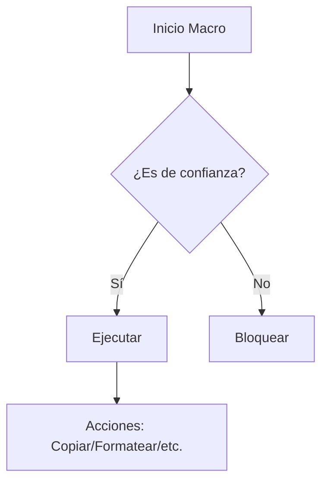

#Programación #Software #Windows #LenguajesDeProgramación #Automatización
# Macros en Windows

## 📌 Definición
- **Macros**: Secuencias automatizadas de comandos que ejecutan tareas repetitivas.
- **Entornos comunes**:
  - [[Microsoft Office]] (Word, Excel, Outlook).
  - [[AutoHotkey]] (automatización global del sistema).
  - [[PowerShell]] (scripts avanzados).

---

## 🔧 Tipos de Macros en Windows

### 1. Macros en Office (VBA)
- **Lenguaje**: [[VBA]] (Visual Basic for Applications).
- **Ejemplo en Excel**:
  ```vba
  Sub HelloWorld()
      MsgBox "¡Hola, mundo!", vbInformation
  End Sub
  ```
- **Usos**:
  - Automatizar informes.
  - Manipular datos en Excel.

### 2. AutoHotkey (AHK)
- **Lenguaje propio**: Scripts con sintaxis simplificada.
- **Ejemplo** (abrir Notepad con `Ctrl+N`):
  ```ahk
  ^n::
      Run Notepad
      Return
  ```
- **Ventajas**:
  - Remapear teclas.
  - Crear atajos personalizados.

### 3. PowerShell
- **Cmdlets**: Comandos tipo `Verb-Noun` (ej: `Get-Process`).
- **Ejemplo** (copiar archivos modificados hoy):
  ```powershell
  Get-ChildItem -Path C:\Docs -File | 
  Where-Object { $_.LastWriteTime -ge (Get-Date).Date } |
  Copy-Item -Destination D:\Backup
  ```

---

## ⚠️ Riesgos de Seguridad
### 🔴 Macros Maliciosas
- **Vectores comunes**:
  - Documentos Office con macros (ej. [[Emotet]]).
  - Ingeniería social (ej. "Habilite macros para ver el contenido").
- **Protecciones**:
  - Deshabilitar macros en [[Trust Center]] de Office.
  - Usar políticas GPO en entornos corporativos.

### 🟢 Buenas Prácticas
1. **Firmar macros** con certificados digitales.
2. **Nunca habilitar macros** en documentos de origen desconocido.
3. Usar alternativas más seguras como [[PowerShell Scripts]] con restricciones de ejecución.

---

## 🛠️ Configuración Clave
### 1. Niveles de Seguridad en Office
  - **Archivo → Opciones → Centro de confianza → Configuración de macros**.
  - Opciones:
    - "Deshabilitar todas las macros sin notificación".
    - "Habilitar solo macros firmadas".

### 2. Políticas de Ejecución en PowerShell
  ```powershell
  Set-ExecutionPolicy RemoteSigned  # Permite scripts locales sin firmar.
  ```

---

## 📂 Ejemplo de Flujo (Mermaid)


---

## 🔍 Herramientas Relacionadas
- **Oficiales**: [[Microsoft Power Automate]] (flujos low-code).
- **Third-party**: [[AutoIt]] (alternativa a AutoHotkey).
- **Análisis de malware**: [[Process Monitor]] para rastrear actividad de macros.

---

## 🔗 Conceptos Relacionados
- [[Malware]] | [[VBA]] | [[Windows Registry]] | [[Scripting]]